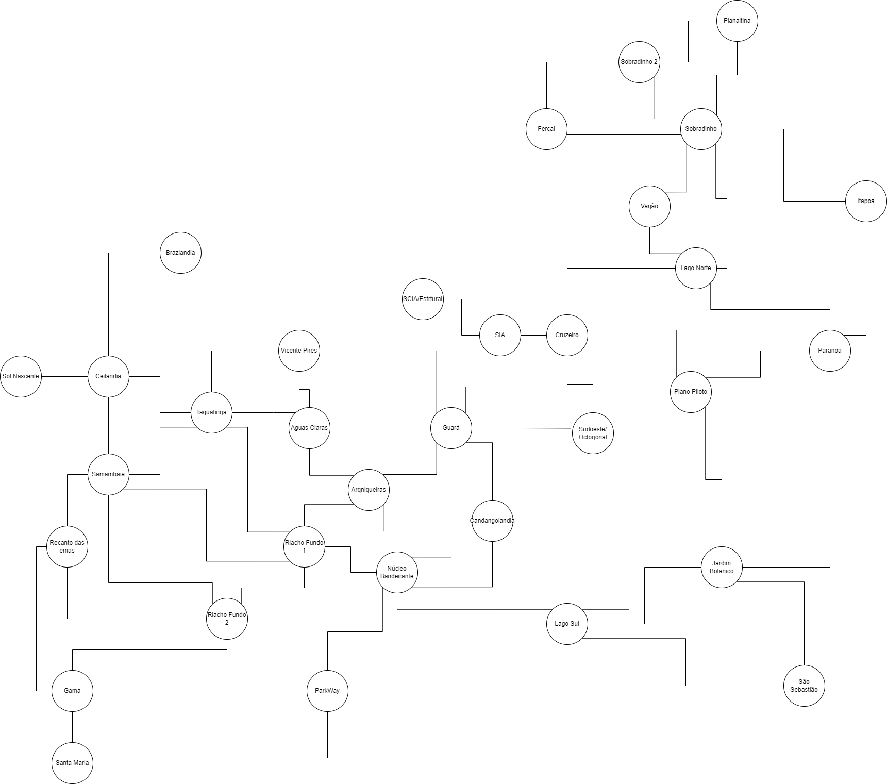

# Role em Brasilia

**Número da Lista**: 22 
**Conteúdo da Disciplina**: Grafos 2 

## Alunos
|Matrícula | Aluno |
| -- | -- |
| 190047968  |  Paulo Vitor Silva Abi Acl |
| 160000572  |  Adrian Soares Lopes |

## Sobre 
O sistema consiste em um app que determina através do algoritmo Dijkstra, a melhor rota entre regiões administrativas de Brasília.

## Screenshots
Print 1:

Print 2:

## Instalação 
**Linguagem**: Python 
**Linguagem**: Java Script 
**Framework**: Leaflet e ReactJs 

Versões:
Node > v18
Npm > 9

Comandos:  
python parse_csv.py  
npm i  
npm start  

## Uso 
Definir a Origem e destino e apertar o botão de busca.

## Outros 
Para o cálculo do algoritmo de Dijkstra, definimos um grafo onde cada região administrativa do DF são nós e as arestas são as ligações entre elas, para isso fizemos um diagrama para a determinação desse grafo e determinamos a distância entre as cidades adjacentes através do google maps. O diagrama está logo a seguir: 

